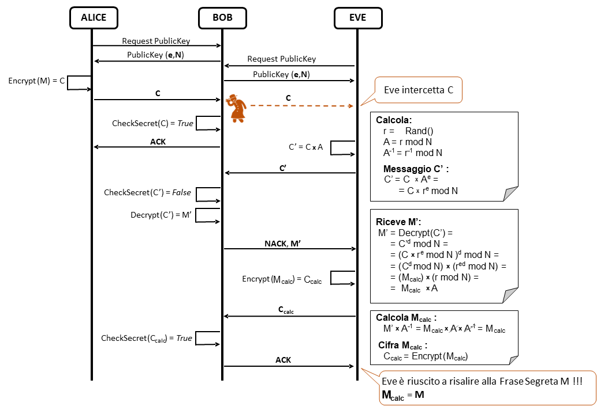

# Elaborato di NetworkSecurity: Chosen Cyphertext Attack
Simulazione di un semplice Chosen Cyphertext Attack in uno scenario vulnerabile con crittografia RSA 'Textbook'

## Descrizione Scenario

1. **Bob (Server)**: Conserva una frase segreta e i client devono dimostrare di conoscerla. Bob risponde con 'ACK' se la frase segreta ricevuta è corretta, altrimenti, risponde con 'NACK' e il messaggio ricevuto decifrato.
2. **Alice (Client legittimo)**: Conosce la frase segreta e la invia al Server.
3. **Eve (Client malizioso)**: Non conosce la frase segreta ma tenta di individuarla. Intercetta il messaggio cifrato di Alice che contiene la frase segreta e interagisce con Bob. Riesce a risale al messaggio originario mediante operazioni matematiche, sfruttando le risposte incaute di Bob.

## Istruzioni per la Simulazione
Per eseguire correttamente la simulazione, seguire il seguente ordine di avvio dei componenti:
1. **Server (Bob)**: Avviare il server eseguendo `bob.py`.
2. **Client legittimo (Alice)**: Avviare il client legittimo eseguendo `alice.py`. 
3. **Client malizioso (Eve)**: Avviare il client malizioso eseguendo `eve.py`.

## Requisiti
Per eseguire correttamente la simulazione, assicurati di avere installate le seguenti librerie Python:
- [Flask](https://pypi.org/project/Flask/)
- [Cryptography](https://pypi.org/project/cryptography/)
- [Requests](https://pypi.org/project/requests/)
- [Libnum](https://pypi.org/project/libnum/)